<h1 align="center">Gamepad-Core 🕹️</h1>

<p align="center">
Modern, policy-based C++ library for advanced gamepad features (DualSense/DS4). Engine-agnostic architecture designed for Unreal, Unity, Godot, and O3DE.
<br />
<br />

<div align="center">


</div>
</p>

## DualSense & DualShock
Simple cross-platform integration for DualSense & DualShock compatible with any engine. A complete, easily customizable framework tested and validated on Unreal Engine and Godot.

**GamepadCore** is a high-performance, platform-agnostic C++ library designed to handle raw HID communication with game controllers. It bypasses generic abstraction layers (like XInput or SDL) to unlock hardware-specific features often inaccessible in standard APIs.

## 🔌 Integrations & Showcase

Since **GamepadCore** is decoupled from game engines, it serves as the backend logic for multiple implementations. See it in action:

| Engine | Project                                                                                                | Description |
| :--- |:-------------------------------------------------------------------------------------------------------| :--- |
|   | [**Godot-Dualsense**](https://github.com/rafaelvaloto/Godot-Dualsense)                                 | A GDExtension wrapper exposing features to GDScript via Signals. |
|   | [**Unreal-Dualsense**](https://github.com/rafaelvaloto/WindowsDualsenseUnreal/tree/v2.0.0-pre-release) | A UE5 Plugin implementation demonstrating how to map raw HID to Unreal's Subsystem and Input mappings. |

> 💡 **Why this matters:** This proves that the core logic (HID parsing, Haptics, Trigger math) is written once and reused everywhere.

## ✨ Key Features
This library implements the raw protocol logic to communicate directly with hardware, offering features that standard drivers miss:

* 🏗️ Extensible Multi-Platform Architecture: Flexible design using policy-based templates. Supporting new hardware or platforms is as simple as implementing a connection interface.

* 🔌 Dynamic Hot-Swap: Automatically detects controller connection and disconnection events in real-time without stalling the main loop.

* 🎯 Adaptive Triggers: Full native control over resistance, vibration, and "weapon recoil" effects on DualSense L2/R2 triggers.

* 💡 Lightbar & LED Control: Direct programmatic access to RGB Lightbar, Player LEDs, and Microphone Mute LED.

* ⚡ Optimized Performance: Zero-allocation loop architecture designed for high-performance scenarios, ideal for multiplayer environments where latency matters.

* ⚙️ Force Feedback: Low-level command generation for standard rumble motors (High/Low frequency).

* 🤝 Non-Intrusive: Designed to coexist with existing input managers (like Windows RawInput, UE Enhanced Input, or SDL), preventing device conflict.
## 🏛️ Architecture Overview

The library follows a strict separation of concerns to ensure portability. By using **Policy-Based Design**, the core logic remains pure C++, while platform-specific details (like how Windows handles USB vs. how Linux handles HID) are injected externally.

### 1. GCore (Abstract Layer)
The stable heart of the library. It defines generic interfaces (`IGamepad`, `IGamepadTrigger`) and the Device Registry logic. It knows **nothing** about the specific OS or Engine, ensuring the code is completely portable.

### 2. Platform Policy (The Bridge)
This is where the flexibility lies. You provide a "Policy" class that tells the Core *how* to identify and communicate with devices on your specific environment.
* **Example:** `WindowsHardwarePolicy` uses `setupapi.h`, while a custom `GodotRegistryPolicy` hooks into Godot's internal callbacks.

### 3. Implementations (The Drivers)
Contains the specific HID protocol logic (byte arrays) for the hardware itself.
* **SonyGamepadAbstract:** Handles logic shared between PS4/PS5.
* **DualSenseLibrary:** Handles specific DualSense features (Adaptive Triggers, Haptics, Lightbar) by interpreting raw input/output reports.

```mermaid
graph BT
    %% BT = Bottom to Top (Faz o Core subir)

    %% Styling
    classDef core fill:#e1f5fe,stroke:#01579b,stroke-width:2px,color:#000;
    classDef adapter fill:#fff9c4,stroke:#fbc02d,stroke-width:2px,color:#000;
    classDef engine fill:#f3e5f5,stroke:#7b1fa2,stroke-width:2px,color:#000;
    classDef platform fill:#e0f2f1,stroke:#00695c,stroke-width:2px,stroke-dasharray: 5 5,color:#000;

    subgraph Framework ["🧠 GamepadCore (Pure C++ Library)"]
        direction TB
        GC["<b>GCore</b><br>Interfaces, Templates & Registry Logic"]:::core
        GI["<b>GImplementations</b><br>HID Parsing & Sony Protocol"]:::core
        
        %% Inverti internamente para o GCore ficar acima das Implementações
        GI --> GC 
    end

    subgraph HAL ["💻 Platform Abstraction Layer"]
        Win["<b>Windows Policy</b><br>(SetupAPI / HID)"]:::platform
        Lin["<b>Linux Policy</b><br>(SDL / HIDAPI)"]:::platform
    end

    subgraph Adapters ["🔌 Adapters Layer (The Bridge)"]
        direction TB
        UE_Adp["<b>Unreal Adapter</b><br>(DeviceRegistryPolicy)"]:::adapter
        GD_Adp["<b>Godot Adapter</b><br>(GodotRegistryPolicy)"]:::adapter
        Other_Adp["<b>Custom Adapter</b><br>(Unity / O3DE Policy)"]:::adapter
    end

    subgraph Engines ["🎮 Target Engines (Clients)"]
        UE["Unreal Engine 5"]:::engine
        GD["Godot 4.x"]:::engine
        Other["O3DE / Custom Engine"]:::engine
    end

    %% Relations (O sentido da seta mantém a lógica de injeção, mas o BT joga o alvo pra cima)
    HAL -.->|"Injects Hardware Access"| Framework
    Adapters -.->|"Injects Engine Behavior"| Framework
    
    UE ==> UE_Adp
    GD ==> GD_Adp
    Other ==> Other_Adp
```



## 💻 Integration Example
1. Basic Setup (C++ Standalone)
   To use GamepadCore in your project, you instantiate the registry with a specific policy.
2. Continuous Device Discovery (Game Loop)
   The registry periodically scans for new devices and updates their connection states.
   #include "GCore/Templates/TBasicDeviceRegistry.h"
   #include "Platforms/Windows/WindowsHardwarePolicy.h"

Policy Setup:
```cpp
// defines the communication between the operating system hardware and the gamepad core library. 
// Using the Windows Policy (e.g,. Linux, Mac)..
#ifdef _WIN32
    #include "../../Examples/Platform_Windows/WindowsHardwarePolicy.h"
    using TestHardwarePolicy = FWindowsPlatform::FWindowsHardwarePolicy;
    using TestHardwareInfo   = FWindowsPlatform::FWindowsHardware;
#else
    // Linux Fallback
    #include "../../Examples/Platform_Linux/LinuxHardwarePolicy.h"
    using TestHardwarePolicy = FLinuxPlatform::FLinuxHardwarePolicy;
    using TestHardwareInfo   = FLinuxPlatform::FLinuxHardware;
#endif

#include "../../Examples/Adapters/Tests/Test_DeviceRegistryPolicy.h"
using TDeviceRegistry = GamepadCore::TBasicDeviceRegistry<Test_DeviceRegistryPolicy>;
```

Main Loop:
```cpp
int main() {
    // 1. Inicializa o Hardware
    auto HardwareImpl = std::make_unique<TestHardwareInfo>();
    IPlatformHardwareInfo::SetInstance(std::move(HardwareImpl));

    // 2. Inicializa o Registry
    auto Registry = std::make_unique<TDeviceRegistry>();

    std::cout << "[System] Waiting for controller connection via USB/BT..." << std::endl;

    // Main Loop
    while (true)
    {
        // frame ~60 FPS
        std::this_thread::sleep_for(std::chrono::milliseconds(16));
        float DeltaTime = 0.016f;

        Registry->PlugAndPlay(DeltaTime); // Scan for new devices

        ISonyGamepad* Gamepad = Registry->GetLibrary(TargetDeviceId); // Get the Gamepad instance

        if (Gamepad && Gamepad->IsConnected())
        {
            if (!bWasConnected)
            {
                bWasConnected = true;
                std::cout << ">>> CONTROLLER CONNECTED! <<<" << std::endl;

                Gamepad->SetLightbar({0, 255, 0});
                Gamepad->SetPlayerLed(EDSPlayer::One, 255);
            }

            Gamepad->UpdateInput(DeltaTime);
            FDeviceContext* Context = Gamepad->GetMutableDeviceContext();
            
            FInputContext InputState = Context->GetInputState();
            if (InputState.bCross)
            {
            }
            
            auto Trigger = Gamepad->GetIGamepadTrigger();
            if (Trigger) {
                 Trigger->SetGameCube(EDSGamepadHand::Right);
            }
        }
    }
}
```
## 🧪 Integration Tests & Examples

This project includes a complete standalone integration test located in:
📂 **`GamepadCore/Tests/Integration/`**

This test serves two purposes:
1. **Validation:** Verifies that the library correctly communicates with hardware (Rumble, LED, Triggers, Inputs).
2. **Reference:** It is the best code example to learn how to initialize the `DeviceRegistry` and the `HardwarePolicy` in a plain C++ application.

### 🚀 How to Run (Hardware Required)
> **Note:** A physical DualSense or DualShock 4 controller must be connected via USB or Bluetooth.

**1. Configure & Build**
Ensure the `BUILD_TESTS` option is enabled (it is ON by default):

### 1. Build the Test Target
You need to compile the `IntegrationTest` executable.

```bash
# Configure (if not done yet)
cmake -S . -B cmake-build-debug -DCMAKE_BUILD_TYPE=Debug -DBUILD_TESTS=ON

# Build only the test executable
cmake --build cmake-build-debug --target IntegrationTest -j
```

### 2. Run the Test
Connect your controller.

Run the executable from the build directory:

Windows (PowerShell):

```PowerShell
.\cmake-build-debug\Tests\Integration\IntegrationTest.exe
```
Linux/macOS:
```Bash
./cmake-build-debug/Tests/Integration/IntegrationTest
```

## 🧑‍💻 Contributing (Build & sanity checks)

GamepadCore is meant to be consumed **from source** (e.g., compiled inside an engine/plugin build).  
This repository still provides a CMake project so contributors can quickly validate changes locally.

### Requirements
- CMake >= 3.20
- C++20 compiler (Clang/GCC/MSVC)
- Ninja (recommended) or Make

### 1) Configure (one time per build type)

```bash
cmake -S . -B cmake-build-debug -DCMAKE_BUILD_TYPE=Debug
cmake -S . -B cmake-build-release -DCMAKE_BUILD_TYPE=Release
```

### 2) Format (before pushing)
```bash
cmake --build cmake-build-debug --target GamepadCoreFormat -j
```
### 3) Compile (after any change)

```bash
cmake --build cmake-build-debug --target GamepadCore -j
cmake --build cmake-build-release --target GamepadCore -j
````

### Notes
- Build artifacts (like `libGamepadCore.a`) are generated inside the build folder (e.g. `cmake-build-release/Source/`).
- Contributors generally should **not** commit build directories (`cmake-build-*`).


## 📄 License


This project is licensed under the **MIT License**. See the `LICENSE` file for details.

Copyright (c) 2025 **Rafael Valoto**

---

## ⚖️ Disclaimer and Trademarks

This software is an independent and unofficial project. It is **not** affiliated, associated, authorized, endorsed by, or in any way officially connected with Sony Interactive Entertainment Inc., Microsoft Corporation, Apple Inc., Epic Games, Unity Technologies, the Godot Engine project, or the Open 3D Foundation.

**Trademarks belong to their respective owners:**

* **Sony:** "PlayStation", "PlayStation Family Mark", "PS5 logo", "PS5", "DualSense", and "DualShock" are registered trademarks or trademarks of Sony Interactive Entertainment Inc. "SONY" is a registered trademark of Sony Corporation.
* **Microsoft:** "Windows" and "Xbox" are registered trademarks of Microsoft Corporation.
* **Apple:** "Mac" and "macOS" are registered trademarks of Apple Inc.
* **Linux:** "Linux" is the registered trademark of Linus Torvalds in the U.S. and other countries.
* **Epic Games:** "Unreal" and "Unreal Engine" are trademarks or registered trademarks of Epic Games, Inc. in the United States of America and elsewhere.
* **Unity:** "Unity", Unity logos, and other Unity trademarks are trademarks or registered trademarks of Unity Technologies or its affiliates in the U.S. and elsewhere.
* **Godot:** "Godot" and the Godot logo are trademarks of the Godot Engine project.
* **O3DE:** "O3DE" and the O3DE logo are trademarks of the Open 3D Foundation.
